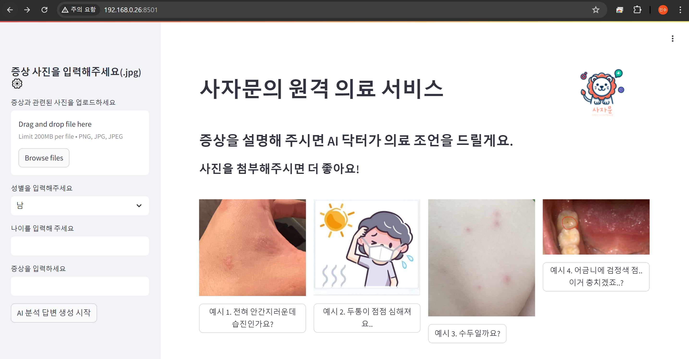
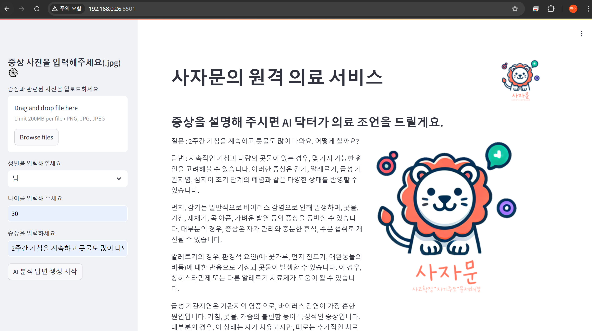
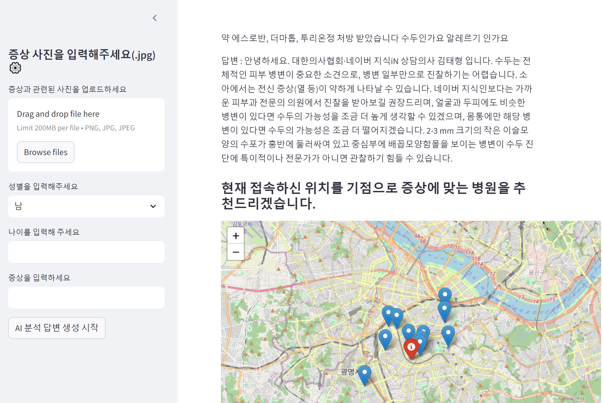
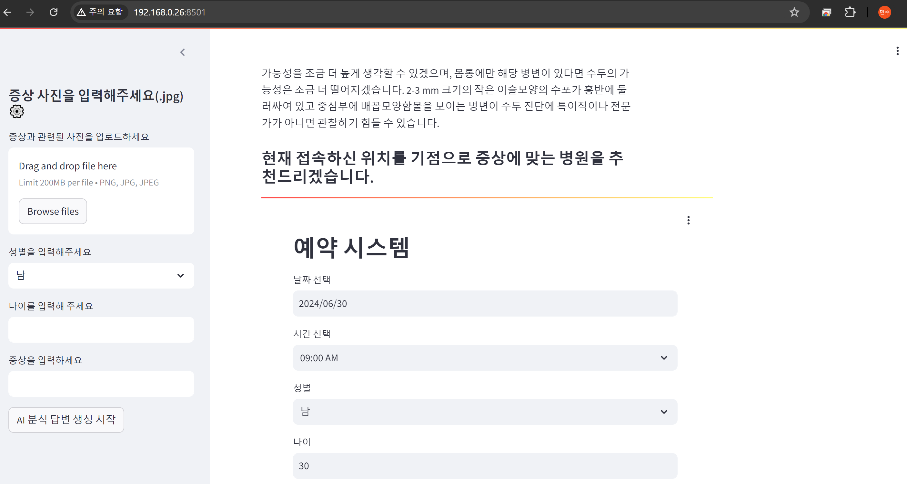

# K-디지털 분야 교직훈련과정 프로젝트 산출물 (사자문 조)
본 레포지토리는 주말2차 K-디지털 분야 교직훈련과정 프로젝트 산출물 입니다.<br>
간단한 AI 챗봇기능을 활용한 의료 상담 및 병원 예약 서비스를 위한 데모를 제공합니다.<br>
서비스 개요는 첨부된 pdf 문서를 확인해주세요. PBL 프로젝트 제작에 도움이 되었으면 좋겠습니다 감사합니다.

### 사자문 조 팀 구성: 
------------------
이경완, 심형광, 정다은, 김미라, 김민수


### 서비스 정보:
------------------
1. LLM 기반으로 정확도 높은 의료 상담을 제공합니다.
2. 상담 내용을 기반으로 근처의 병원 목록을 알려주고, 간편한 예약을 도와줍니다.
3. 의료기관의 좌표 정보(의료기관.csv)는 공공데이터 포털(https://www.data.go.kr/data/15075103/fileData.do#tab-layer-file)에서 다운로드 했습니다.

<p align="center">
  
  <br>
  <em>메인 화면</em>
</p>

<p align="center">
  
  <br>
  <em>실시간 AI 의료상담 화면</em>
</p>

<p align="center">
  
  <br>
  <em>답변 및 근처 병원 추천 화면</em>
</p>

<p align="center">
  
  <br>
  <em>병원 예약 화면</em>
</p>

### 환경 설정:
------------------  
#### 필수 라이브러리 설치

```bash
pip install -r requirements.txt
```  


### 데모 실행 및 주의사항
------------------ 
demo 폴더 내 'app.py' 파일을 다음 명령어를 사용하여 실행하면, 웹페이지를 통해 모델을 직접 테스트해 볼 수 있습니다.  
streamlit run demo/app.py

루트 경로에 .env 파일을 만들어, 아래 형식으로 CHATGPT API 정보를 넣어야 AI 챗봇 기능이 동작합니다.<br>
API_KEY = 본인이 발급받은 api 키

예약시스템 동작을 위해서는 별도의 서버를 추가로 띄워줘야 합니다.
streamlit run demo/reserve.py 를 실행하고 해당 아이피 정보를 app.py의 33번 라인 link 변수에 올바르게 할당해 주세요.  

사용자들이 사용한 질문/답변과 예약 정보는 각각 log.csv, reserve.csv 파일에 저장되며, 
log_check.ipynb 파일에서 간편하게 확인할 수 있습니다.

### 문의
김민수 : rlaalstn1504@naver.com
